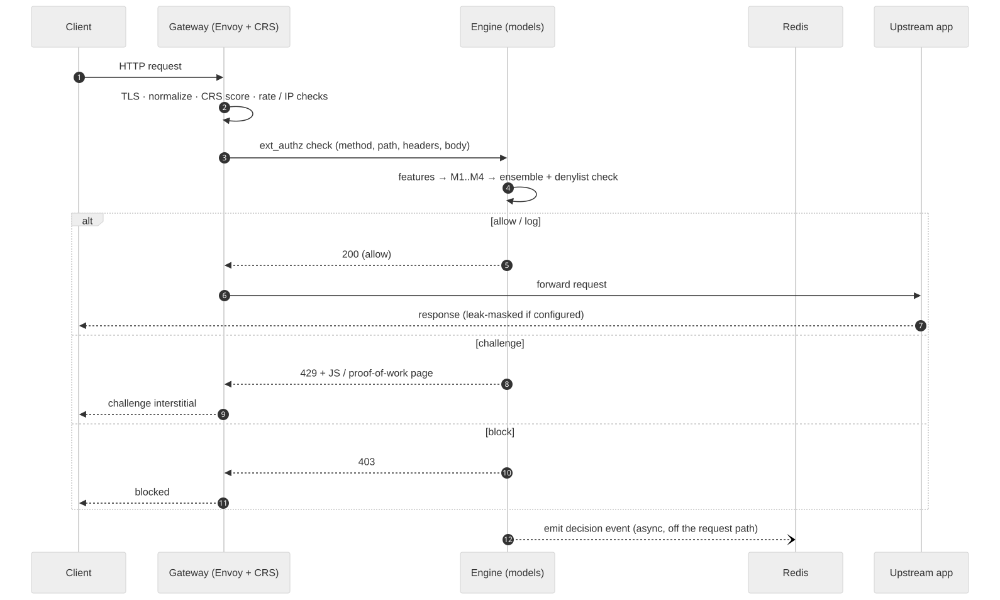

# sentinel-sidecar

A drop-in security sidecar for any HTTP service. It runs next to your app as an
adjacent container, between the app and the internet, and combines OWASP rules
with five specialist models — four deciding inline, one reasoning out of band — to
allow, challenge, or block each request. The protected app needs no code changes.

**Status:** all 8 build phases complete. Release gate passes — **96.4% attack
detection, 0.00% false positives, ~1 ms added latency (p95)** on the validation
corpus. See [Validation](#validation--release-gate).



*Two lanes: the inline lane decides every request in about a millisecond; the
out-of-band lane learns from the traffic and feeds findings back into the inline
decision.*

---

## Contents

- [Why](#why) · [Highlights](#highlights) · [Quickstart](#quickstart)
- [How it works](#how-it-works) · [Protect your own app](#protect-your-own-app)
- [Configuration reference](#configuration-reference) · [The models](#the-models)
- [The feedback loop & admin API](#the-feedback-loop--admin-api) · [Operations](#operations)
- [Validation](#validation--release-gate) · [Development](#development) · [Limitations](#limitations--roadmap)

---

## Why

A single-purpose WAF blocks known-bad signatures and little else. sentinel-sidecar
adds behavioural and bot scoring, an ML payload classifier, prompt-injection
defence for LLM endpoints, response leak masking, and — the part a static WAF
lacks — an out-of-band analyst that studies traffic over time and turns what it
finds into inline blocks within seconds. You get all of it by adding one container
in front of a service you can't or don't want to modify.

Reach for it when you need to:

- **protect a legacy or internal app** you can't safely change,
- **guard an LLM / chat endpoint** against prompt injection and response leaks,
- **stop scanners, scrapers and credential stuffing** on an API,
- **add a learning defence layer** in front of an existing service.

## Highlights

- **L0 rules** — OWASP CRS 4.14.0 (Coraza WASM), per-IP rate limiting, IP allow/deny lists.
- **Five models** — M1 payload, M2 behaviour, M3 bot, M4 prompt-injection (inline);
  M5 LLM triage (out of band).
- **Four verdicts** — `allow`, `log`, `challenge`, `block` — with a JS + proof-of-work challenge tier.
- **Three modes** — `monitor`, `learn`, `enforce`: deploy in observation, switch to enforcement when the numbers hold.
- **Closed feedback loop** — findings become audited, time-limited denylist entries the engine enforces inline.
- **Response leak masking** — stack traces, DB errors and secrets are masked out of responses.
- **One config file per app**, validated before anything starts.
- **`lite`** (CPU-only) and **`full`** (adds the LLM analyst) profiles.

## Quickstart

Requires **Docker** with **Compose v2.20+** (for `include:` support).

```sh
make demo-up      # builds images, starts OWASP Juice Shop behind the sidecar on :8080
make smoke        # 30 end-to-end checks against the live stack
```

Try it (the demo runs in `monitor` mode, so attacks are scored and logged but not blocked):

```sh
# benign request — passes through
curl -s -o /dev/null -w '%{http_code}\n' 'http://127.0.0.1:8080/rest/products/search?q=apple'
# → 200

# the engine and every layer are live even in monitor mode; see what it caught:
docker compose -f deploy/compose/demo/compose.yaml exec sentinel-redis \
  redis-cli XREVRANGE sentinel:events + - COUNT 1
```

To see it **block**, run the demo's enforce path or flip `mode: enforce` in
`deploy/compose/demo/sentinel.yaml`. In enforce mode a SQLi or a scanner
user-agent returns `403`, and a burst of distinct paths from one client returns a
`429` JS/proof-of-work challenge.

```sh
make demo-down    # tear everything down
```

## How it works

Every request runs the **inline lane** and gets a verdict before the app sees it.
A copy of each decision streams to the **out-of-band lane**, which never sits on
the request path.

### Request lifecycle



The gateway terminates TLS, normalizes the request, runs OWASP CRS and the cheap
L0 checks, then calls the engine over ext_authz. The engine extracts features
once, runs the models, and returns a verdict. The decision is emitted to Redis
asynchronously — it never delays the response.

### How a verdict is chosen



Model scores combine with a **weighted noisy-OR** (independent detectors only ever
raise risk; a model with no opinion never dilutes one that fired). On top of that,
a **hard signal** — a confident payload match, a known scanner, an extreme scan
rate, or a prompt injection — is decisive and overrides the blend. An active
dynamic-denylist entry is checked inline. Finally the **mode** decides whether the
verdict bites.

### Verdicts

| Verdict | What happens |
|---|---|
| `allow` | Forwarded to the app. The verdict is recorded, not returned to the client. |
| `log` | Allowed, but flagged as suspicious. What `monitor` mode downgrades a block to. |
| `challenge` | A JS + proof-of-work interstitial (HTTP 429). Solving it sets a signed clearance cookie the engine verifies. |
| `block` | Returned as `403`. Reserved for confident detections and active denylist entries. |

### Modes

| Mode | Blocks? | Notes |
|---|---|---|
| `monitor` | No | Scores and logs the intended action. Safe default for rollout. |
| `learn` | No | Like monitor, and also records per-route parameter baselines. |
| `enforce` | Yes | Verdicts take effect. |

## Protect your own app

1. **Build the images** (once): `make images`.
2. **Write a `sentinel.yaml`** next to your compose file. Only `upstream.url` is
   required; start from [`sentinel.example.yaml`](sentinel.example.yaml).
3. **Include the fragment and stop publishing your app's ports** so the sidecar is
   the only way in:

   ```yaml
   include:
     - path: /path/to/sentinel-sidecar/deploy/compose/sentinel.compose.yaml
       project_directory: .

   services:
     app:
       image: my-app        # no `ports:` here — traffic enters through the sidecar
   ```

4. **Start in `monitor`**, watch the events and metrics, then switch to `enforce`.

At startup a one-shot `sentinel-config` container validates the file and renders
the gateway and engine configs. **An invalid config fails closed — the gateway
never starts.**

### Deployment topology



For **Kubernetes**, [`deploy/k8s/sentinel-sidecar.yaml`](deploy/k8s/sentinel-sidecar.yaml)
is a worked example running the same containers as pod-local sidecars, with an
init container rendering the config from a ConfigMap. Only the gateway is exposed.

For the **`full` profile** (the M5 LLM analyst), also include
[`deploy/compose/full.compose.yaml`](deploy/compose/full.compose.yaml), set
`analyst.enabled: true` and `analyst.llm` in your config, and pull a model
(`docker exec <ollama> ollama pull qwen2.5:3b`).

## Configuration reference

One `sentinel.yaml` per protected service. Only `upstream.url` is required;
everything else has a default. Every field below is validated at startup.

### `upstream` — the protected app

| Field | Default | Meaning |
|---|---|---|
| `url` | *(required)* | `scheme://host[:port]` of the app, reachable only through the sidecar. |
| `timeout_ms` | `30000` | Upstream request timeout. |
| `connect_timeout_ms` | `5000` | Upstream connect timeout. |

### `listen` — the public listener

| Field | Default | Meaning |
|---|---|---|
| `port` | `8080` | Container port the gateway listens on. |
| `metrics_port` | `9902` | Internal Prometheus port (`/metrics`, loopback only). |
| `health_path` | `/__sentinel/healthz` | Local health endpoint, never proxied. |
| `tls.enabled` | `false` | Terminate TLS at the sidecar. |
| `tls.cert` / `tls.key` | — | Cert and key paths (required when TLS is enabled). |

### `mode` and `profile`

| Field | Values | Meaning |
|---|---|---|
| `mode` | `monitor` \| `learn` \| `enforce` | Whether verdicts are enforced (see [Modes](#modes)). |
| `profile` | `lite` \| `full` | `lite` is CPU-only; `full` adds the M5 LLM analyst. |

### `defaults` — baseline policy (routes inherit and can override)

| Field | Default | Meaning |
|---|---|---|
| `on_engine_error` | `open` | If the engine is unreachable: `open` (fail open) or `closed` (fail closed). Per route. |
| `on_timeout` | `open` | Behaviour on engine timeout (currently follows `on_engine_error`). |
| `max_inspect_bytes` | `65536` | Max request body sent to the engine for inspection. |
| `crs.paranoia` | `2` | OWASP CRS paranoia level (1–4). |
| `crs.mode` | `score` | `score` (CRS contributes, engine decides — recommended) or `block` (CRS blocks directly). |
| `thresholds.log` / `.challenge` / `.block` | `0.4` / `0.7` / `0.85` | Risk cut-offs mapping to verdicts (`log ≤ challenge ≤ block`). |
| `models.m1..m4, crs` | `0.4 / 0.2 / 0.2 / 0.0 / 0.2` | Per-model weights in the noisy-OR blend. |

### `routes` — per-path policy (first match wins)

| Field | Meaning |
|---|---|
| `match.path_prefix` / `path_exact` | Path to match (one of the two). |
| `match.methods` | Optional list of HTTP methods. |
| `bypass: true` | Skip **all** sentinel filters for this route. |
| `inspect: false` | Skip the engine (L0/CRS still apply). |
| `llm_endpoint: true` | Turn on the M4 prompt-injection model for this route. |
| `rate_limit.per_ip` | Per-IP limit, e.g. `10/m` (`s`/`m`/`h`). |
| `rate_limit.per_account` | Per-account limit. *(defined; enforcement deferred)* |
| `on_engine_error`, `thresholds`, `crs`, `models` | Override the corresponding `defaults` for this route. |

### `identity` — how the client is identified

| Field | Default | Meaning |
|---|---|---|
| `client_ip_from` | `remote_addr` | `remote_addr` \| `x-forwarded-for` \| `cf-connecting-ip`. Derived from Envoy's trusted address, never a spoofable client header. |
| `trusted_proxies` | `[]` | CIDRs of proxies in front (sets Envoy's trusted-hop count for `x-forwarded-for`). |
| `account_from.jwt_claim` / `.header` | — | Where to read the account identifier. |

### `lists`, `response_inspection`, `redaction`

| Field | Default | Meaning |
|---|---|---|
| `lists.allow` | `[]` | CIDRs never blocked (exempt from deny list and denylist). |
| `lists.deny` | `[]` | CIDRs blocked at L0. |
| `response_inspection.enabled` | `false` | Scan upstream responses for leaks. |
| `response_inspection.action` | `log` | `mask` (replace the body, tag `x-sentinel-leak`) or `log`. |
| `redaction.headers` / `body_fields` | auth/cookie/… / `password` | Fields stripped before an event or the M5 prompt sees them. |

### `analyst` and `telemetry`

| Field | Default | Meaning |
|---|---|---|
| `analyst.enabled` | `false` | Run M5 LLM triage (needs `analyst.llm`). The correlator runs regardless. |
| `analyst.llm.provider/url/model` | — | e.g. `ollama` / `http://ollama:11434` / `qwen2.5:3b`. |
| `analyst.auto_actions.denylist` | `true` | Allow the loop to write denylist entries. |
| `analyst.auto_actions.rules` | `propose` | `propose` (record for review) \| `apply` (act) \| `off`. |
| `analyst.auto_actions.threshold_nudge` | `false` | *(defined; not yet implemented)* |
| `telemetry.metrics` / `logs` | `prometheus` / `json` | Metrics and log format. |

## The models

| ID | Specialty | Lane | How it works |
|---|---|---|---|
| **L0** | Known-bad signatures | inline | OWASP CRS 4.14.0 (Coraza WASM) + rate limits + IP lists. |
| **M1** | Payload attacks | inline | Char-CNN (INT8 ONNX, ~0.3 ms): SQLi, XSS, traversal, command & template injection. |
| **M2** | Behaviour / anomaly | inline | Per-client request rate, distinct-path fan-out, parameter novelty (Redis window). |
| **M3** | Bot / automation | inline | Scanner & automation user-agents; missing browser-shaped headers. |
| **M4** | Prompt injection | inline | Binary char-CNN, active only on `llm_endpoint` routes. |
| **M5** | LLM triage | out-of-band | Local instruct model judges gray-zone requests; output is schema-validated, input treated as untrusted. |
| **C1** | Campaign correlator | out-of-band | Windowed detection of distributed stuffing and slow scans across many clients. |

Inline models run on CPU as INT8 ONNX; a regex fallback keeps the engine working
if a model file is absent. The models are trained by the pipeline in
[`training/`](training/) (`make train`).

## The feedback loop & admin API



A high-confidence M5 verdict or a slow-scan campaign becomes a **dynamic denylist
entry** (Redis, escalating-but-capped TTL) that the engine enforces on the next
request from that client — an out-of-band finding becomes an inline block within
seconds, then expires. Guardrails: allowlisted clients are never denied,
distributed campaigns are proposal-only (never an automatic mass-block), and every
action is audited. The whole thing is gated by `analyst.auto_actions`.

The analyst exposes an admin API on `:9200` (internal):

```sh
NET=sentinel-demo_default    # your compose network
run(){ docker run --rm --network "$NET" curlimages/curl -s "$@"; }

run http://sentinel-analyst:9200/admin/actions      # audit log of applied actions
run http://sentinel-analyst:9200/admin/denylist     # active denylist entries + TTL
run http://sentinel-analyst:9200/admin/proposals    # findings awaiting review
run -X DELETE 'http://sentinel-analyst:9200/admin/denylist?ip=1.2.3.4'   # lift a block
```

## Operations

- **Rollout:** start in `monitor`, watch `sentinel:events` and the metrics, run
  `make gate` against your traffic, then switch to `enforce`.
- **Metrics (internal):** gateway `:9902/metrics`, engine `:9001/metrics`, analyst
  `:9200/metrics`. Scrape over the compose/pod network.
- **Challenge secret:** set a stable `SENTINEL_CHALLENGE_SECRET` in production so
  JS/PoW clearance survives restarts and multiple instances.
- **Behaviour tuning:** `SENTINEL_M2_RATE_MAX` and `SENTINEL_M2_FANOUT_MAX` adjust
  the per-client rate and fan-out thresholds.
- **Profiles:** `lite` needs no LLM and runs anywhere; `full` adds Ollama for M5.

## Validation & release gate

`make gate` spins a throwaway enforce stack, replays a labeled corpus, and checks
the results against fixed targets — failing the build if any gate is missed.

| Gate | Target | Current |
|---|---|---|
| Attack detection | ≥ 95% | **96.4%** (54 of 56 payloads) |
| False positives | ≤ 0.1% | **0.00%** (0 of 2,000 benign inputs) |
| Added latency p95 / p99 | < 25 / 50 ms | **within noise** |

Detection is measured end-to-end through the sidecar in the recommended posture
(CRS in `score` mode, the engine deciding). See [`eval/report.md`](eval/report.md)
for the full report, per-family breakdown, and the adversarial replay against real
scanners. The corpus is small and curated: 56 attack payloads across 5 families and
2,000 benign values, so treat the figures as a regression gate, not a benchmark.

## Development

```
control/     config schema, loader, and the Envoy/engine renderer
gateway/     Envoy image with the Coraza WASM plugin (OWASP CRS) baked in
engine/      inline engine (HTTP ext_authz): features, scorers, ensemble, challenge, models
analyst/     out-of-band analyst: stream consumer, correlator, M5 client, applier, admin API
training/    model training pipeline (char-CNN → INT8 ONNX)
eval/        release-gate harness, corpora, and reports
deploy/      compose fragment + demo, full-profile overlay, k8s example
diagrams/    mermaid sources and rendered SVGs used in this README
docs/        ARCHITECTURE.md — deep design rationale and the phase-by-phase log
```

Common tasks:

| Command | Does |
|---|---|
| `make test` | Unit tests (control, engine, analyst). |
| `make demo-up` / `demo-down` | Start / stop the Juice Shop demo stack. |
| `make smoke` | End-to-end checks against the running demo. |
| `make gate` | Run the release gate and write a report. |
| `make replay` | M1 payload classifier against unseen payloads. |
| `make train` | Retrain M1/M4 and export INT8 ONNX. |
| `make images` | Build the control, gateway, engine and analyst images. |

Deep design rationale and the phase-by-phase build log live in
[`docs/ARCHITECTURE.md`](docs/ARCHITECTURE.md).

## Limitations & roadmap

Stated plainly:

- **Models are trained on synthetic corpora.** They meet the gate on the curated
  corpus; real corpora (SecLists, CSIC, live traffic) would harden them.
- **CRS runs in `score` mode by default** — `block` mode is too false-positive-prone
  at paranoia 2 for API traffic. Feeding the CRS anomaly score into the engine
  ensemble is a planned enhancement.
- Deferred: bounded threshold nudges, per-account rate limits, a gRPC ext_authz
  transport, and granular (span-level) response masking rather than whole-body.

## License

MIT. See [LICENSE](LICENSE).
